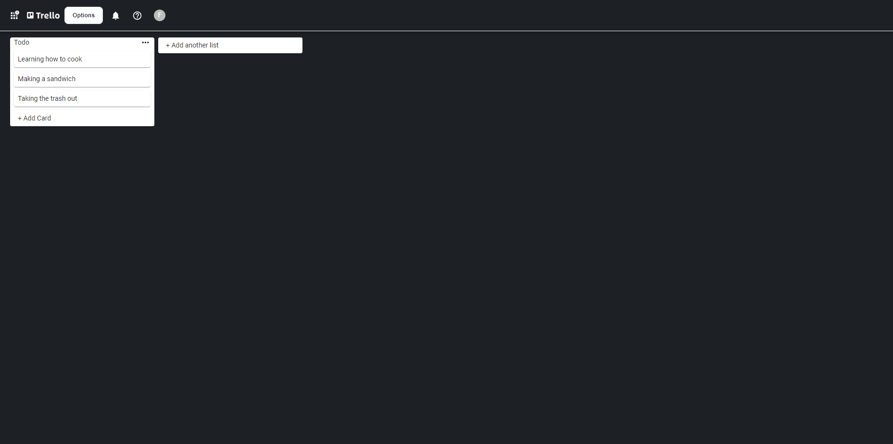

# Fake Trello

### 💻 Status: Em desenvolvimento
---

Projeto kanban desenvolvido em React.js para por em prática habilidades de "drag and drop" com layout baseado no site **[Trello](https://trello.com)**
---


---

## 🚀 Conhecendo o projeto

Estas instruções foram elaboradas para possibilitar que você obtenha uma cópia funcional do projeto em sua máquina local, com o intuito de facilitar o desenvolvimento e os testes.

### 📋 Pré-requisitos

Do que você precisará para instalar e gerenciar o código, e como instalá-lo?

```
Instale as seguintes ferramentas de desenvolvimento:

1. Node.js e npm:
    Instale o Node.js, que inclui o npm (gerenciador de pacotes do Node.js). Você pode baixar a versão mais recente em nodejs.org.

2. Editor de código:
    Escolha um editor de código, como Visual Studio Code, Atom ou Sublime Text, para facilitar o desenvolvimento.

3. Git:
    Tenha o Git instalado para controlar versões e baixar dependências. Você pode baixá-lo em git-scm.com.

4. Terminal:
    Utilize um terminal de sua escolha para executar comandos. No Windows, o PowerShell ou o Git Bash são opções comuns.

5. Yarn:
    Por fim, mas juntamente ao primeiro item, instale o Yarn em seu dispositivo com o comando "npm install -g yarn" para que seja possivel a instalação das dependencias de forma automatizada
```

### 🔧 Instalação

Uma série de exemplos passo-a-passo que informam o que você deve executar para ter um ambiente de desenvolvimento em execução.

Para instalar as dependencias do projeto, utilize o segunite comando dentro da pasta:

```
yarn install
```

E execute localmente com:

```
yarn start
```

## 🛠️ Construído com

Ferramenta utilizada para criação do projeto:

* [React.js](https://react.dev) - O framework web usado

## ✒️ Autor

* **Felipe França** - *Desenvolvedor do projeto* - [FelipeFrancca](https://github.com/FelipeFrancca/)

## 📄 Licença

Este projeto está sob a licença Copyright (c) 2023 [FelipeFrancca](https://github.com/FelipeFrancca/) - veja o arquivo [Licença](license.txt) para detalhes.

## 🎁 Expressões de gratidão

* Conte a outras pessoas sobre este projeto 📢;
* Obrigado pelo interesse em meu trabalho, e espero que eu possa te inspirar a desenvolver algo grandioso! 🫂;


---